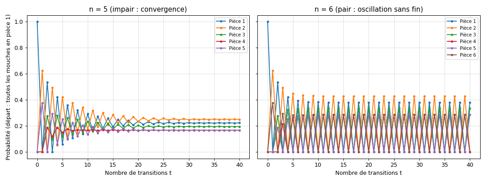

# Promenades aléatoires entre pièces : chaîne de Markov

Des mouches se déplacent au hasard entre $n$ pièces disposées en cercle, en passant par des portes de largeurs différentes. On modélise ce mouvement par une **chaîne de Markov**, on calcule sa **distribution stationnaire** par la méthode de la puissance, et on montre que le comportement à long terme dépend de la **parité** du nombre de pièces.



*Probabilité de présence dans chaque pièce au cours du temps, toutes les mouches partant de la pièce 1. À gauche (5 pièces) : convergence vers une répartition stable. À droite (6 pièces) : oscillation sans fin entre les pièces paires et impaires.*

> **En bref**
> - La probabilité de passer d'une pièce à sa voisine est proportionnelle à la largeur de la porte.
> - Pour 5 pièces, la répartition converge vers $\pi = (0{,}222 ;\ 0{,}250 ;\ 0{,}194 ;\ 0{,}167 ;\ 0{,}167)$ quel que soit le point de départ, en accord avec une formule analytique.
> - Pour 6 pièces, des mouches parties d'une seule pièce oscillent indéfiniment : la chaîne est périodique.
> - La vitesse de convergence est fixée par la deuxième valeur propre de la matrice de transition.

## 1. Objectif

$n$ pièces sont disposées en cercle ; la pièce $i$ communique avec ses deux voisines $i \pm 1 \pmod n$ par des portes de largeur $L_{i,i\pm1}$. À chaque pas de temps, chaque mouche change de pièce, indépendamment des autres, en choisissant une porte avec une probabilité proportionnelle à sa largeur. Questions :

1. Comment construire la matrice de transition ?
2. Comment les mouches se répartissent-elles au bout d'un temps long ?
3. Cette répartition dépend-elle de la répartition initiale ?
4. Que change un nombre de pièces pair ?

Configurations étudiées : $n = 5$ avec des portes de (125, 100, 75, 75, 75) cm, et $n = 6$ avec (125, 100, 75, 75, 75, 75) cm.

## 2. Modèle : chaîne de Markov

### Matrice de transition

On note $P_{ij}$ la probabilité de passer de la pièce $i$ à la pièce $j$ en un pas. Seules les voisines sont accessibles :

$$P_{i,i+1} = \frac{L_{i,i+1}}{L_{i-1,i} + L_{i,i+1}}, \qquad P_{i,i-1} = \frac{L_{i-1,i}}{L_{i-1,i} + L_{i,i+1}}$$

Chaque ligne somme à 1 : une mouche va forcément quelque part. Pour $n = 5$ :

$$P = \begin{pmatrix}
0 & 0{,}625 & 0 & 0 & 0{,}375 \cr 
0{,}556 & 0 & 0{,}444 & 0 & 0 \cr 
0 & 0{,}571 & 0 & 0{,}429 & 0 \cr 
0 & 0 & 0{,}5 & 0 & 0{,}5 \cr 
0{,}5 & 0 & 0 & 0{,}5 & 0
\end{pmatrix}$$

Par exemple, depuis la pièce 1, la porte vers la pièce 2 mesure 125 cm et celle vers la pièce 5 mesure 75 cm : $P_{12} = 125/200 = 0{,}625$.

### Évolution

Si $p(t)$ est le vecteur ligne des probabilités de présence à l'instant $t$ :

$$p(t+1) = p(t)\thinspace P \quad \Longrightarrow \quad p(t) = p(0)\thinspace P^t$$

### Distribution stationnaire

Une distribution $\pi$ qui ne change plus vérifie $\pi P = \pi$ avec $\sum_i \pi_i = 1$ : c'est un vecteur propre à gauche de $P$ pour la valeur propre 1.

Ici, on peut la trouver à la main. La chaîne est **réversible** : elle vérifie l'équilibre détaillé $\pi_i P_{ij} = \pi_j P_{ji}$ avec

$$\pi_i = \frac{L_{i-1,i} + L_{i,i+1}}{2\sum_k L_k}$$

La probabilité d'être dans une pièce est proportionnelle à la largeur totale de ses deux portes. En effet, $\pi_i P_{i,i+1} = L_{i,i+1} / (2\sum_k L_k)$ ne dépend que de la porte, donc prend la même valeur dans les deux sens.

## 3. Méthode numérique : la méthode de la puissance

On part d'une distribution initiale $p(0)$ et on itère $p \leftarrow pP$ jusqu'à ce que deux itérés successifs diffèrent de moins de $10^{-6}$ (en norme $L^1$), avec un maximum de 10 000 itérations.

**Vitesse de convergence.** En décomposant $p(0)$ sur les vecteurs propres de $P$, chaque composante est multipliée à chaque pas par sa valeur propre $\lambda_k$. La valeur propre 1 donne $\pi$ ; les autres s'éteignent comme $\lvert \lambda_k \rvert^t$. La convergence est donc dominée par la plus grande valeur propre en module après 1, notée $\lambda_2$.

| $n$ | Valeurs propres de $P$ | $\lvert \lambda_2 \rvert$ | Conséquence |
|---|---|---|---|
| 5 | 1 ; 0,366 ; 0,25 ; −0,763 ; −0,853 | 0,853 | erreur divisée par $10^6$ en ≈ 87 itérations |
| 6 | 1 ; ±0,553 ; ±0,444 ; **−1** | 1 | pas de convergence en général |

Pour $n = 5$, le programme converge en 66 itérations (départ uniforme) et 93 itérations (départ pièce 1), cohérent avec cette estimation.

## 4. Implémentation

| Fonction | Rôle |
|---|---|
| `matrice_transition(n, L)` | construit $P$ : largeur de la porte vers chaque voisine, puis normalisation de chaque ligne |
| `methode_puissance(P, pi0)` | itère $\pi \leftarrow \pi P$ depuis $\pi_0$ ; renvoie la distribution, le nombre d'itérations et un indicateur de convergence |

Pour chaque configuration, le programme :

1. construit $P$ ;
2. applique la méthode de la puissance depuis deux états initiaux : répartition uniforme, et toutes les mouches dans la pièce 1 ;
3. calcule $p(1000) = p(0)\thinspace P^{1000}$ et $p(1001)$ avec `np.linalg.matrix_power`, pour vérifier le comportement à long terme ;
4. trace l'évolution des probabilités sur 40 pas depuis la pièce 1.

## 5. Résultats

### Cinq pièces : convergence

| Pièce | 1 | 2 | 3 | 4 | 5 |
|---|---|---|---|---|---|
| Largeur totale des portes (cm) | 200 | 225 | 175 | 150 | 150 |
| $\pi$ calculée | 0,2222 | 0,2500 | 0,1944 | 0,1667 | 0,1667 |
| $\pi$ théorique (largeur / 900) | 0,2222 | 0,2500 | 0,1944 | 0,1667 | 0,1667 |

Le résultat est le même depuis les deux états initiaux, et $p(1000) = p(1001) = \pi$. La pièce 2, bordée par les deux plus grandes portes, accueille le plus de mouches ; les pièces 4 et 5, bordées de portes identiques, en accueillent autant. Avec des portes toutes égales, on obtiendrait une répartition uniforme $1/n$.

Juste après le lâcher dans la pièce 1, les mouches se trouvent toutes dans les pièces 2 et 5, seules accessibles directement ; puis la répartition oscille en s'amortissant vers $\pi$ (figure de gauche).

### Six pièces : oscillation

- **Départ uniforme** : convergence en 20 itérations vers $\pi = (0{,}190 ;\ 0{,}214 ;\ 0{,}167 ;\ 0{,}143 ;\ 0{,}143 ;\ 0{,}143)$, là encore égale à la largeur totale des deux portes de chaque pièce divisée par 1 050.
- **Départ pièce 1** : la méthode de la puissance **ne converge pas**. Après 1000 pas, les mouches sont toutes dans les pièces impaires : $(0{,}381 ;\ 0 ;\ 0{,}333 ;\ 0 ;\ 0{,}286 ;\ 0)$. Après 1001 pas, toutes dans les pièces paires : $(0 ;\ 0{,}429 ;\ 0 ;\ 0{,}286 ;\ 0 ;\ 0{,}286)$.

### Pourquoi la parité compte

Avec un nombre **pair** de pièces, on peut colorier le cercle en alternant deux couleurs (pièces impaires, pièces paires). Chaque déplacement fait changer de couleur : une mouche partie d'une pièce impaire est dans une pièce impaire à chaque pas pair, et dans une pièce paire à chaque pas impair. La chaîne est **périodique de période 2**, ce qui se traduit par la valeur propre $-1$ de $P$ : la composante correspondante change de signe à chaque pas sans jamais s'éteindre.

On le vérifie sur les nombres : aux temps pairs, la probabilité dans chaque pièce impaire vaut exactement $2\pi_i$ (0,381 = 2 × 0,190), puisque toute la masse est concentrée sur la moitié des pièces.

Un départ **uniforme** place autant de mouches sur chaque couleur : la composante oscillante est nulle dès le départ, et la répartition converge vers $\pi$. Plus généralement, pour $n$ pair, on converge si et seulement si la moitié exacte des mouches part des pièces paires.

Avec un nombre **impair** de pièces, ce coloriage est impossible : on peut revenir à son point de départ en 2 pas (aller-retour) comme en $n$ pas (tour complet), et le PGCD de ces durées vaut 1. La chaîne est **apériodique** : d'après le théorème de Perron-Frobenius, elle converge vers $\pi$ quel que soit l'état initial.

Même pour $n$ pair, la **fraction du temps** passée par une mouche dans chaque pièce, moyennée sur une longue durée, tend vers $\pi$ : c'est la répartition à un instant donné qui oscille.

## 6. Limites et pistes

- **Simulation individuelle** : suivre des milliers de mouches par tirages aléatoires (méthode de Monte-Carlo) et comparer leurs histogrammes à $p(t)$ illustrerait le lien entre trajectoires individuelles et description probabiliste.
- **Chaîne « paresseuse »** : autoriser une mouche à rester dans sa pièce avec une petite probabilité supprime la périodicité, et la chaîne converge alors pour tout $n$.
- **Calcul direct** : $\pi$ s'obtient aussi en résolvant le système linéaire $(P^T - I)\pi = 0$ avec $\sum \pi_i = 1$, ou par diagonalisation (`np.linalg.eig`), sans itération.

## 7. Lancer le code

```bash
pip install -r requirements.txt
python promenades.py            # résultats dans le terminal + figure
python promenades.py --sauver   # enregistre la figure dans figures/
```

---

Projet réalisé en L3 Physique à CY Cergy Paris Université (cours de méthodes numériques, octobre 2024).
